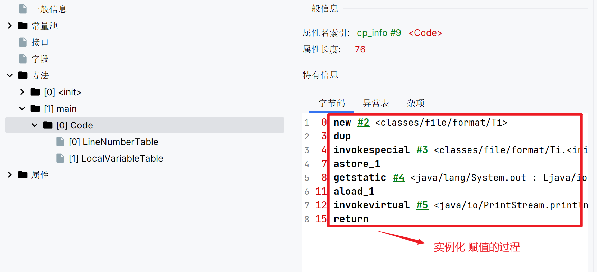

# 为什么双重检测锁 要添加volatile

> 我们单独利用这个文章来分析下，为什么要添加volatile，难道不添加就不行嘛？

我们在回答这个问题之前，先来了解下【单例模式的双重检测锁】

## 前置知识：单例模式

```java
public class Mgr06 {
  private static volatile Mgr06 INSTANCE;
  
  // 实现单例模式的双重检测锁
  public Mgr06 getINSTANCE() throws InterruptedException {
    if (INSTANCE == null) {
      synchronized (Mgr06.class) {
        if (INSTANCE == null) {
          Thread.sleep(1000);
          INSTANCE = new Mgr06();
        }
      }
    }
    
    return INSTANCE;
  }
}
```

上述内容是单例模式的常用的解决方案，看到这里我们就不仅要提出几个问题了。
> - QA: 为什么用两个 ` == null ` 来进行判断
> - ACK: 第一个`== null` 其实就是单纯为了判断变量中是否存在实例。但是为什么还要在第二个位置判断呢，目的为了防止在执行第一个判断~加锁之间，该实例被别的线程实例化

> - QA：为了避免多线程的话，为什么不在方法上直接添加锁
> - ACK: 如果一旦在方法上加锁后，当变量已经被实例化后，别的程序需要获取实例的时候，都需要锁住这个方法（更有甚者多线程的情况下会出现排队的情况），其实我们直接拿到变量中的实例就可以，没必要加锁，这样无非浪费资源


## 前置知识：JVM优化

> 其实 JVM执行的时候做了很多优化，其实就包括`指令重排`。 那么什么是指令重排呢，就是没有依赖的关系的指令在执行时，其实是乱序的。

我们使用伪代码 来讲述下这个实例
```java
String b = "";
String c = "";


// 实际的运行结果
String c = "";
String b = "";
```

如我们上述执行的代码，b 以及c的赋值相互没有任何依赖关系，基于JVM的优化，往往执行过程跟我们预期的不太一致


## 前置知识：字节码解析

```java
public class Ti {
  public static void main(String[] args) {
    Ti t = new Ti();
    System.out.println(t);
  }
}
```



通过上述的实例我们可以看到，虽然是短短的 实例化 && 赋值的操作，但是会被转换为多个Java 指令。


上述指令在执行过程中有可能指令重排

## 正文解析

```java
public class Ti {
  public static void main(String[] args) {
    Ti t = new Ti();
    System.out.println(t);
  }
}
```

```text
 0 new #2 <classes/file/format/Ti>
 3 dup
 4 invokespecial #3 <classes/file/format/Ti.<init> : ()V>
 7 astore_1
```

以上是执行代码`new Ti()` 生成指令。
- `new #2 <classes/file/format/Ti>` 这是一个初期化的过程，执行此代码的时候已经开始给对象分配内存了
- `invokespecial #3 <classes/file/format/Ti.<init> : ()V>` 这是一个调用构造方法，设置初始值的过程
- `astore_1` 这是将内存地址 指向变量的过程


如果按正常的逻辑执行的话，以上的内容肯定是对的。但是，JVM在执行的时候会发生指令重排, 如下伪代码：
```java
0 new #2 <classes/file/format/Ti>
7 astore_1
4 invokespecial #3 <classes/file/format/Ti.<init> : ()V>
```

刚初期化好 && 申请完内存 && 将内存的值 指向了定义的变量

刚好此时另一个线程就过来了，会发现变量上已经有值了就直接拿走了。但是此时的值是一个未实例化完的值

---

那么类似这种问题我们应该那么处理呢？如果我们限制指令不发生重排是不是就好了，这个作用就体现了 【volatile 的实际意义】